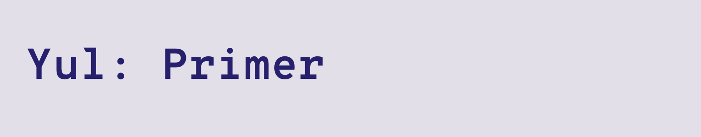

## Overview

This project supports research article: [wertikalk.com/research/yul-primer](https://wertikalk.com/research/yul-primer).

## Getting started

It is a standard [Foundry](https://book.getfoundry.sh/) project.

The main files are located at `./src/sol` and `./src/yul` - these correspond to the
implementation of a same contract using [Solidity](https://soliditylang.org/) and [Yul](https://docs.soliditylang.org/en/latest/yul.html) respectively.

The `./test` directory contains 3 fuzz tests that compare the results given by both contract implementations.

### Steps

Installing Foundry (if not present):

```
curl -L https://foundry.paradigm.xyz | bash
```

Running tests:

```
forge test -vvv
```
